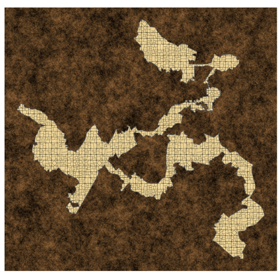
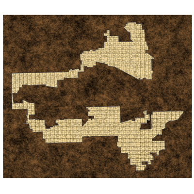
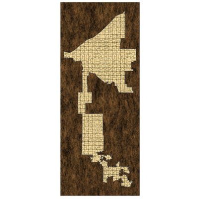
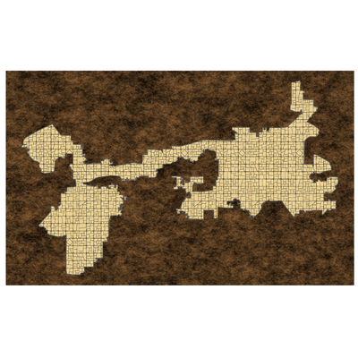

# District Dungeons

Inspired by [a Tweet by Zach Silberberg](https://x.com/zachsilberberg/status/1526274411103408129) (back when they were still "tweets"), this R script uses congressional district geoJSON data from <https://github.com/unitedstates/districts> to create dungeon maps in the shape of US congressional districts.

## Examples

Four districts from the Ranker.com article [The Most Gerrymandered Districts In America](https://www.ranker.com/list/most-gerrymandered-districts-in-america/eric-vega) as dungeons.

 [Maryland 3](https://en.wikipedia.org/wiki/Maryland%27s_3rd_congressional_district)

 [Illinois 4](https://en.wikipedia.org/wiki/Illinois%27s_4th_congressional_district)

 [Ohio 11](https://en.wikipedia.org/wiki/Ohio%27s_11th_congressional_district)

 [Texas 33](https://en.wikipedia.org/wiki/Texas%27s_33rd_congressional_district)

## Details

No attempt has been made to make the output into actual, useable dungeons. Notice, for instance, in the Illinois 4 map above, if the squares are 5 feet, then one section of the map is no wider than an arrow slit. But perhaps you can use them as inspiration.

By default, this script saves images for all 400+ district geometries available from <https://theunitedstates.io> as .png images with a resolution of 320 ppi. To adjust the image resolution, change the `dpi` argument of the `ggsave` function. Valid values for dpi include numbers and the strings "retina" (320), "print" (300), and "screen" (72).

Allowing the script to generate all possible images at the default size and resolution results in almost 2 gb of images.

## Resources

- District geometry from <https://github.com/unitedstates/districts>
    - [CC0 1.0 Universal public domain dedication](https://creativecommons.org/publicdomain/zero/1.0/)
- Dirt image from <https://www.deviantart.com/o-o-o-o-0-o-o-o-o/art/Seamless-Dirt-Texture-338582624>
    - [Creative Commons Attribution-Share Alike 3.0 License](https://creativecommons.org/licenses/by-sa/3.0/)
- Tile image from <http://free-dungeon-tiles-to-print.blogspot.com>: <http://4.bp.blogspot.com/-vM-JZkTyE8w/VlNlEDdIz5I/AAAAAAAAEj8/oNyNWnfqEgk/s1600/RoomFlag_DFP1_1stEd.png>
    - [Creative Commons Attribution-Share Alike 3.0 License](https://creativecommons.org/licenses/by-sa/3.0/)

